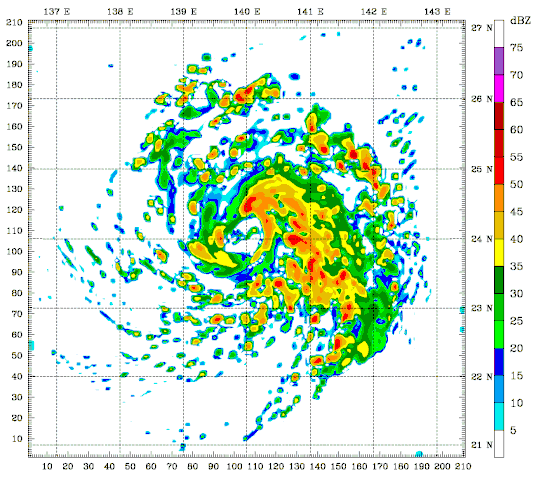
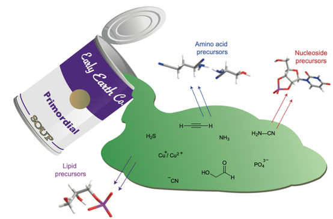
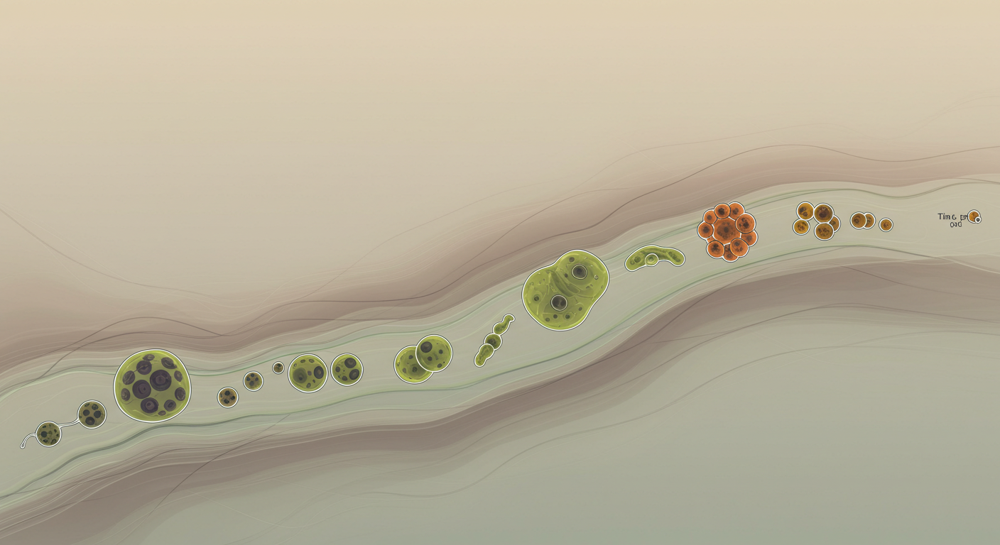

    <canvas id="canvas" style="width: 100%; height: 100%"></canvas>
      <component is="script">
        const canvas = document.getElementById('canvas');
        const ctx = canvas.getContext('2d');
        function resize() {
            canvas.width = window.innerWidth;
            canvas.height = window.innerHeight;
        }
        window.addEventListener('resize', resize);
        resize();
        const cellSize = 3;
        const cols = Math.floor(canvas.width / cellSize);
        const rows = Math.floor(canvas.height / cellSize);
        let grid = new Array(cols * rows).fill(0);
        let nextGrid = new Array(cols * rows).fill(0);
        for(let i = 0; i < grid.length; i++) {
            grid[i] = Math.random() > 0.70 ? 1 : 0;
        }
        function getIndex(x, y) {
            x = (x + cols) % cols;
            y = (y + rows) % rows;
            return y * cols + x;
        }
        function computeNextState(x, y) {
            let neighbors = 0;
            for(let i = -1; i <= 1; i++) {
                for(let j = -1; j <= 1; j++) {
                    if(i === 0 && j === 0) continue;
                    neighbors += grid[getIndex(x + i, y + j)];
                }
            }
            const idx = getIndex(x, y);
            if(grid[idx] === 1) {
                return neighbors === 2 || neighbors === 3 ? 1 : 0;
            } else {
                return neighbors === 3 ? 1 : 0;
            }
        }
        function sleep(ms) {
          return new Promise(resolve => setTimeout(resolve, ms));
        }
        function draw() {
            ctx.fillStyle = '#111';
            ctx.fillRect(0, 0, canvas.width, canvas.height);
            ctx.fillStyle = '#fffff4';
            for(let x = 0; x < cols; x++) {
                for(let y = 0; y < rows; y++) {
                    if(grid[getIndex(x, y)] === 1) {
                      ctx.beginPath();
                      ctx.arc(x * cellSize + cellSize/2, y * cellSize + cellSize/2, (cellSize - 1)/2, 0, Math.PI * 2);
                      ctx.fill();
                    }
                }
            }
        }
        function update() {
            for(let x = 0; x < cols; x++) {
                for(let y = 0; y < rows; y++) {
                    nextGrid[getIndex(x, y)] = computeNextState(x, y);
                }
            }
            const blockSize = 3;
            const blockChance = 0.0001;
            for(let x = 0; x < cols; x += blockSize) {
                for(let y = 0; y < rows; y += blockSize) {
                    if(Math.random() < blockChance) {
                        for(let i = 0; i < blockSize; i++) {
                            for(let j = 0; j < blockSize; j++) {
                                if(x + i < cols && y + j < rows) {
                                    nextGrid[getIndex(x + i, y + j)] = 1;
                                }
                            }
                        }
                    }
                }
            }
            [grid, nextGrid] = [nextGrid, grid];
        }
        async function animate() {
            await sleep(20);
            update();
            draw();
            requestAnimationFrame(animate);
        }
        animate();
    </component>

<v-click>

# Une thèse en ~~180 secondes~~  *30 minutes*

Apprentissage non supervisé dans les systèmes complexes

<a class="absolute bottom-2 right-2 text-sm opacity-90" href="https://mt180.fr/" target="_blank">Concours "ma thèse en 180 secondes"</a>

</v-click>

Un simulation du Jeu de la Vie de Conway

---
transition: fade-out

---

# Un peu de contexte

- Un stage de recherche de 6 mois à Prague (S2 2019)

- 3 ans de recherche à l'INRIA/ENS et au CIIRC  *(Institut de recherche en informatique, robotique et cybernétique   de l'Université technique de Prague)*

- 2 directeurs de thèse: Tomas Mikolov et Josef Sivic
  

    
    
  

- Thèse finalisée en Décembre 2022, soutenue en Mai 2023 

---
transition: slide-left
---

# Qu'ont-ils en commun ?

---
layout: 3-images
transition: slide-left
imageLeft: '/assets/image.jpg'
imageTopRight: '/assets/traffic.jpg'
imageBottomRight: '/assets/ant.jpg'
---

# Qu'ont-ils en commun ?

---
layout: section
transition: slide-left
---

<h1 class="text-shadow-lg text-shadow-black-10">Les systèmes complexes</h1>

---
transition: slide-left
---
# Qu'est-ce qu'un système complexe ?

	
> <h2>"<i>Le tout est plus que la somme de ses parties</i>"</h2>

**Définition simple** : Un système complexe est constitué de: 

<v-clicks>

- nombreuses parties qui interagissent entre elles 

- pour créer des comportements inattendus

- qui ne peuvent pas être expliqués en observant les parties individuelles seules.

</v-clicks>

---
transition: slide-left
---

# Exemples dans votre quotidien

<v-clicks>

- **Réseaux Sociaux**: Chaque personne fait des choix *simples* (comme aimer, partager, commenter) mais ensemble ils créent des tendances virales, des memes, des changement globaux et systémiques

- **Embouteillages**: Chaque voiture qui suit des règles *simples* (accélérer, freiner, changer de voie), qui peuvent créer des vagues de congestion et des embouteillages spontanés

- **Météo**: Les interactions entre des molécules dans l'air et l'eau créent des tempêtes et des phénomènes météorologiques complexes

</v-clicks>

<v-click at="-2">

</v-click>

<v-click at="2">

</v-click>

<v-click at="3">

</v-click>

---
transition: slide-left
---

# Caractéristiques des systèmes complexes

### **Émergence** : Des patterns apparaissent qui n'ont pas été programmés dans les parties individuelles

  - Comme les fourmis qui ne savent pas qu'elles construisent des colonies de fourmis

### **Auto-organisation** : Le système s'organise sans un contrôle central

  - Comme les oiseaux qui forment des V en volant sans leader

### **Imprévisible** : Les petites modifications peuvent avoir des grandes conséquences

  - Comme comment n'importe quelle petite variation de pression de l'air peut affecter la météo ailleurs

<v-click>

<h2 class="text-center mt-5">La science des systèmes complexes est l'étude de ces objets aux caractéristiques étonnantes</h2>

</v-click>

---
transition: slide-up
---

<h2>Simulons un système complexe</h2>

<h3>Règles simples</h3>

Chaque "oiseau" doit:

1. Essayer de rester proche de ses voisins

2. Ne pas foncer dans les autres oiseaux 

3. Adapte sa vitesse pour être proche de celle de ses voisins

<iframe src="https://www.complexity-explorables.org/slides/flockn-roll/" width="100%" height="700px" scrolling="no"></iframe>

---
layout: section
transition: slide-left
---

<h1 class="text-shadow-lg text-shadow-black-10">Évolution ouverte   (<i>open-ended evolution</i>)</h1>

---
transition: slide-left
---

# Évolution ouverte

> <h2>"<i>Une capacité à continuer à grandir, évoluer et créer de nouvelles choses à l'infini</i>"</h2>

---
layout: statement
---

<h1 style="line-height: 1.2;">
  On ne connaît pas de système 
  (algorithme, machine, équation, etc.) 
  qui 
  reproduise
  l'évolution ouverte  naturelle
</h1>

---
layout: two-cols
transition: slide-left
---

::right::

+

Systèmes complexes

Évolution ouverte ?

---
layout: two-cols
---

# L'automate cellulaire
## Le plus "simple" des systèmes complexes

<svg xmlns="http://www.w3.org/2000/svg" viewBox="0 0 200 200">
  <g transform="scale(0.7)">

  <rect width="200" height="200" fill="white"/>

  <line x1="50" y1="0" x2="50" y2="200" stroke="black" stroke-width="2"/>

  <rect v-click="1" v-click.hide="2" x="50" y="0" width="50" height="50" fill="black"/>
  <rect v-click="1" v-click.hide="2" x="50" y="50" width="50" height="50" fill="black"/>
  <rect v-click="1" v-click.hide="2" x="150" y="100" width="50" height="50" fill="black"/>
  <rect v-click="1" v-click.hide="2" x="150" y="50" width="50" height="50" fill="black"/>

  <rect v-click="2" x="100" y="0" width="50" height="50" fill="black"/>
  <rect v-click="2" x="100" y="100" width="50" height="50" fill="black"/>

  <line x1="100" y1="0" x2="100" y2="200" stroke="black" stroke-width="2"/>

  <line x1="150" y1="0" x2="150" y2="200" stroke="black" stroke-width="2"/>

  <line x1="0" y1="50" x2="200" y2="50" stroke="black" stroke-width="2"/>

  <line x1="0" y1="100" x2="200" y2="100" stroke="black" stroke-width="2"/>

  <line x1="0" y1="150" x2="200" y2="150" stroke="black" stroke-width="2"/>
  </g>
</svg>

::right::

### Une grille

### Des cellules "vivantes" (noires) ou "mortes" (blanches)

### Les cellules évoluent selon des règles simples

1. Une cellule morte possédant exactement trois cellules voisines vivantes devient vivante (elle naît)

2. Une cellule vivante ne possédant pas exactement deux ou trois cellules voisines vivantes meurt.

---
---

<component is="script">
        const canvas2 = document.getElementById('canvas2');
        const ctx2 = canvas2.getContext('2d');
        function resize() {
            canvas2.width = window.innerWidth * 2;
            canvas2.height = window.innerHeight * 2;
        }
        window.addEventListener('resize', resize);
        resize();
        const cellSize2 = 3;        
        const cols2 = Math.floor(canvas2.width / cellSize2);
        const rows2 = Math.floor(canvas2.height / cellSize2);
        let grid2 = new Array(cols2 * rows2).fill(0);
        let nextGrid2 = new Array(cols2 * rows2).fill(0);
        for(let i = 0; i < grid2.length; i++) {
            grid2[i] = Math.random() > 0.70 ? 1 : 0;
        }
        function getIndex2(x, y) {
            x = (x + cols2) % cols2;
            y = (y + rows2) % rows2;
            return y * cols2 + x;
        }
        function sleep2(ms) {
          return new Promise(resolve => setTimeout(resolve, ms));
        }
        function computeNextState2(x, y) {
            let neighbors = 0;
            for(let i = -1; i <= 1; i++) {
                for(let j = -1; j <= 1; j++) {
                    if(i === 0 && j === 0) continue;
                    neighbors += grid2[getIndex2(x + i, y + j)];
                }
            }
            const idx = getIndex2(x, y);
            if(grid2[idx] === 1) {
                return neighbors === 2 || neighbors === 3 ? 1 : 0;
            } else {
                return neighbors === 3 ? 1 : 0;
            }
        }
        function draw2() {
            ctx2.fillStyle = '#ffffff';
            ctx2.fillRect(0, 0, canvas2.width, canvas2.height);
            ctx2.fillStyle = '#000004';
            for(let x = 0; x < cols2; x++) {
                for(let y = 0; y < rows2; y++) {
                    if(grid2[getIndex2(x, y)] === 1) {
                      ctx2.beginPath();
                      ctx2.arc(x * cellSize2 + cellSize2/2, y * cellSize2 + cellSize2/2, (cellSize2 - 1)/2, 0, Math.PI * 2);
                      ctx2.fill();
                    }
                }
            }
        }
        function update2() {
            for(let x = 0; x < cols2; x++) {
                for(let y = 0; y < rows2; y++) {
                    nextGrid2[getIndex2(x, y)] = computeNextState2(x, y);
                }
            }
            const blockSize2 = 3;
            const blockChance2 = 0.0001;
            for(let x = 0; x < cols2; x += blockSize2) {
                for(let y = 0; y < rows2; y += blockSize2) {
                    if(Math.random() < blockChance2) {
                        for(let i = 0; i < blockSize2; i++) {
                            for(let j = 0; j < blockSize2; j++) {
                                if(x + i < cols2 && y + j < rows2) {
                                    nextGrid2[getIndex2(x + i, y + j)] = 1;
                                }
                            }
                        }
                    }
                }
            }
            [grid2, nextGrid2] = [nextGrid2, grid2];
        }
        async function animate2() {
            await sleep2(20);
            update2();
            draw2();
            requestAnimationFrame(animate2);
        }
        animate2();
</component>
    <canvas id="canvas2" style="width: 100%; height: 100%"></canvas>

---
layout: statement
---

<h1 class="text-md text-shadow-lg text-shadow-black-10">Ces systèmes complexes
sont-ils capables d'évoluer ?</h1>

---
layout: section
transition: slide-left
---

# Alors, tu cherches, mais tu trouves ?

---
layout: image-left
image: /assets/paper1.png
backgroundSize: 25em 90%
transition: slide-left
---

## Comment mesurer qu'il se passe quelque chose d'intéressant dans un système complexe ?

## Application à des automates cellulaires

## Proposition d'une nouvelle métrique de complexité

---
layout: image-left
image: /assets/paper2.png
backgroundSize: 25em 90%
transition: slide-left
---

## Que se passe-t-il dans les (très) grands systèmes complexes ?

## Application à des automates cellulaires

## Trouver des systèmes complexes avec différentes complexités à différentes échelles

---
layout: image-left
image: /assets/paper3.png
backgroundSize: 25em 90%
transition: slide-left
---

## Ils sont bien complexes tous ces systèmes, mais qu'est-ce qu'ils peuvent *apprendre* ?

## Application à des automates cellulaires

## Les automates complexes apprenent plus vite que d'autres ! 

---
layout: statement
---

# Merci pour votre attention !

---
---

# Ressources

<h2>📚 Livres</h2>

- "*Le Quark et le Jaguar*" - Murray Gell-Mann
- "*Why Greatness Cannot Be Planned: The Myth of the Objective*" - Joel Lehman & Kenneth Stanley
- "*The Selfish Gene*" - Richard Dawkins
- "*Origins of Life*" - Freeman Dyson

<h2>🎥 Vidéos</h2>

- ["*Le Jeu de la Vie*" - Science Étonnante](https://www.youtube.com/watch?v=S-W0NX97DB0)
- ["*Emergence: How Stupid Things Become Smart Together*" - Kurzgesagt](https://www.youtube.com/watch?v=16W7c0mb-rE)
- ["*Magnetic Micro-Robots*" - Veritasium](https://www.youtube.com/watch?v=N7lXymxsdhw)
- ["*Let’s BUILD a COMPUTER in CONWAY's GAME of LIFE ⠠⠵*" - Alan Zucconi](https://www.youtube.com/watch?v=Kk2MH9O4pXY)

<h2>📄 Articles</h2>

- ["An Overview of Open-Ended Evolution: Editorial Introduction to the Open-Ended Evolution II Special Issue" - Norman Packard et al.](https://direct.mit.edu/artl/article-abstract/25/2/93/2927/An-Overview-of-Open-Ended-Evolution-Editorial?redirectedFrom=fulltext) 

<h2>🌐 Sites Web</h2>

- [Google](https://www.google.com/search?q=game+of+life)
- [Complexity Explorables](https://www.complexity-explorables.org/)
- [Complexity Explorer](https://www.complexityexplorer.org)
- [Santa Fe Institute](https://www.santafe.edu)

