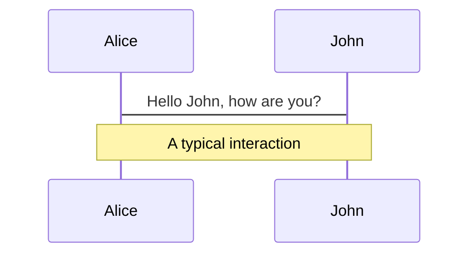
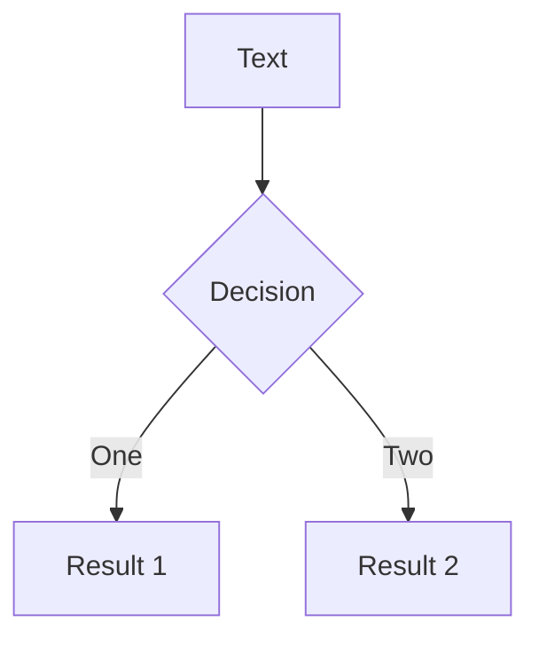
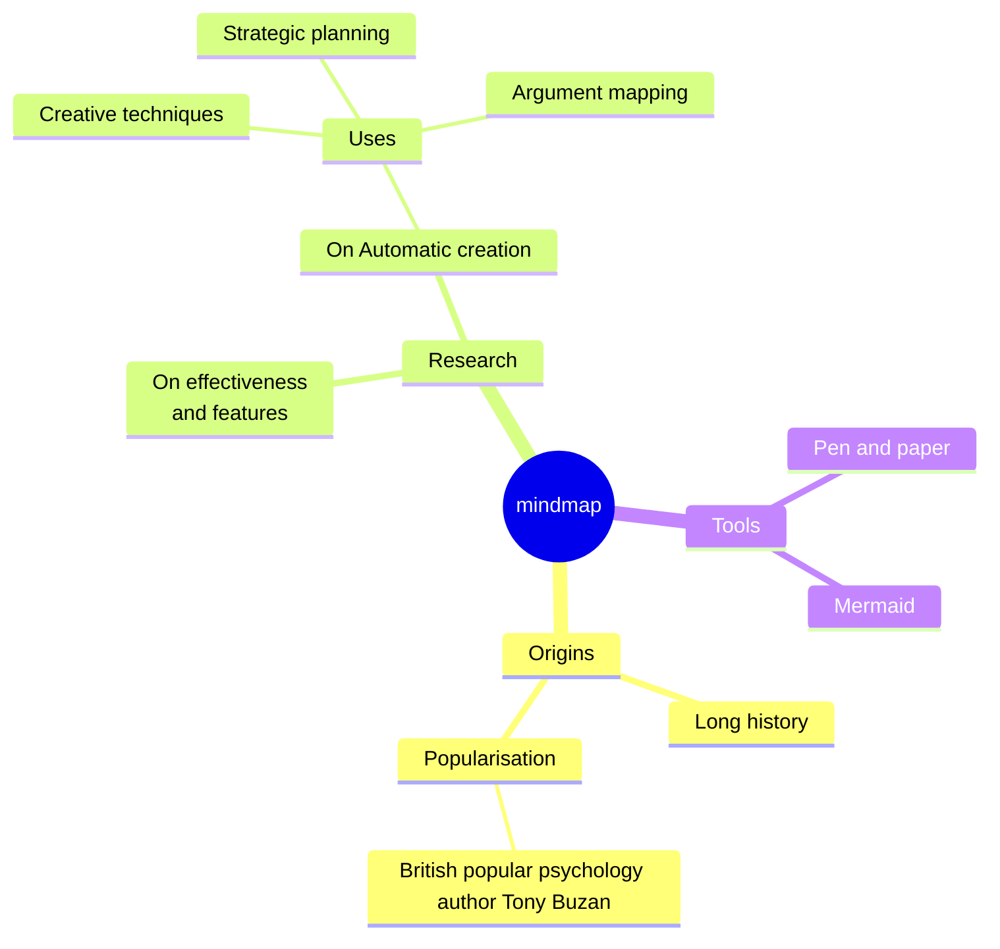
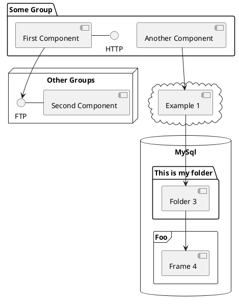

<div style="position: absolute; height: 120vh; width: 150vw; left: -7%; top: -5%; z-index: -1;">
    <canvas id="canvas" style="width: 100%; height: 100%"></canvas>
      <component is="script">
        const canvas = document.getElementById('canvas');
        const ctx = canvas.getContext('2d');
        function resize() {
            canvas.width = window.innerWidth;
            canvas.height = window.innerHeight;
        }
        window.addEventListener('resize', resize);
        resize();
        const cellSize = 3;
        const cols = Math.floor(canvas.width / cellSize);
        const rows = Math.floor(canvas.height / cellSize);
        let grid = new Array(cols * rows).fill(0);
        let nextGrid = new Array(cols * rows).fill(0);
        for(let i = 0; i < grid.length; i++) {
            grid[i] = Math.random() > 0.70 ? 1 : 0;
        }
        function getIndex(x, y) {
            x = (x + cols) % cols;
            y = (y + rows) % rows;
            return y * cols + x;
        }
        function computeNextState(x, y) {
            let neighbors = 0;
            for(let i = -1; i <= 1; i++) {
                for(let j = -1; j <= 1; j++) {
                    if(i === 0 && j === 0) continue;
                    neighbors += grid[getIndex(x + i, y + j)];
                }
            }
            const idx = getIndex(x, y);
            if(grid[idx] === 1) {
                return neighbors === 2 || neighbors === 3 ? 1 : 0;
            } else {
                return neighbors === 3 ? 1 : 0;
            }
        }
        function sleep(ms) {
          return new Promise(resolve => setTimeout(resolve, ms));
        }
        function draw() {
            ctx.fillStyle = '#111';
            ctx.fillRect(0, 0, canvas.width, canvas.height);
            ctx.fillStyle = '#448';
            for(let x = 0; x < cols; x++) {
                for(let y = 0; y < rows; y++) {
                    if(grid[getIndex(x, y)] === 1) {
                      ctx.beginPath();
                      ctx.arc(x * cellSize + cellSize/2, y * cellSize + cellSize/2, (cellSize - 1)/2, 0, Math.PI * 2);
                      ctx.fill();
                    }
                }
            }
        }
        function update() {
            for(let x = 0; x < cols; x++) {
                for(let y = 0; y < rows; y++) {
                    nextGrid[getIndex(x, y)] = computeNextState(x, y);
                }
            }
            const blockSize = 3;
            const blockChance = 0.0001;
            for(let x = 0; x < cols; x += blockSize) {
                for(let y = 0; y < rows; y += blockSize) {
                    if(Math.random() < blockChance) {
                        for(let i = 0; i < blockSize; i++) {
                            for(let j = 0; j < blockSize; j++) {
                                if(x + i < cols && y + j < rows) {
                                    nextGrid[getIndex(x + i, y + j)] = 1;
                                }
                            }
                        }
                    }
                }
            }
            [grid, nextGrid] = [nextGrid, grid];
        }
        async function animate() {
            await sleep(20);
            update();
            draw();
            requestAnimationFrame(animate);
        }
        animate();
    </component>
</div>

<style>
.slidev-vclick-target {
  transition: opacity 2s ease;
}
</style>
<v-click>

# Une thèse en ~~180 secondes~~ <br>*30 minutes*

<p class="text-sm opacity-50">Apprentissage non supervisé dans les systèmes complexes</p>

</v-click>

<div class="absolute bottom-2 left-2 text-sm opacity-20">
Un simulation du Jeu de la Vie de Conway
</div>


---
transition: fade-out

---

# Un peu de contexte

- Un stage de recherche de 6 mois à Prague (S2 2019)

- 3 ans de recherche à l'INRIA/ENS et au CIIRC <br>*(Institut de recherche en informatique, robotique et cybernétique de l'Université technique de Prague)*

- 2 directeurs de thèse: Tomas Mikolov et Josef Sivic
  <div class="flex justify-center">
    
    
  </div>

- Thèse finalisée en Décembre 2022, soutenue en Mai 2023

---
transition: fade-out
---

# Qu'ont-ils en commun ?

<div class="grid grid-cols-2">


</div>

---
layout: 3-images
transition: fade-out
imageLeft: './assets/image.jpg'
imageTopRight: './assets/traffic.jpg'
imageBottomRight: './assets/ant.jpg'
---
---

# Qu'ont-ils en commun ?

<div class="grid grid-cols-3">


</div>


---
transition: slide-up
level: 2
---

# Navigation

Hover on the bottom-left corner to see the navigation's controls panel, [learn more](https://sli.dev/guide/ui#navigation-bar)

## Keyboard Shortcuts

|                                                     |                             |
| --------------------------------------------------- | --------------------------- |
| <kbd>right</kbd> / <kbd>space</kbd>                 | next animation or slide     |
| <kbd>left</kbd>  / <kbd>shift</kbd><kbd>space</kbd> | previous animation or slide |
| <kbd>up</kbd>                                       | previous slide              |
| <kbd>down</kbd>                                     | next slide                  |

<!-- https://sli.dev/guide/animations.html#click-animation -->

<p v-after class="absolute bottom-23 left-45 opacity-30 transform -rotate-10">Here!</p>

---
layout: two-cols
layoutClass: gap-16
---

# Table of contents

You can use the `Toc` component to generate a table of contents for your slides:

```html
<Toc minDepth="1" maxDepth="1" />
```

The title will be inferred from your slide content, or you can override it with `title` and `level` in your frontmatter.

::right::

<Toc text-sm minDepth="1" maxDepth="2" />

---
layout: image-right
image: https://cover.sli.dev
---

# Code

Use code snippets and get the highlighting directly, and even types hover!

```ts {all|5|7|7-8|10|all} twoslash
// TwoSlash enables TypeScript hover information
// and errors in markdown code blocks
// More at https://shiki.style/packages/twoslash

import { computed, ref } from 'vue'

const count = ref(0)
const doubled = computed(() => count.value * 2)

doubled.value = 2
```

<arrow v-click="[4, 5]" x1="350" y1="310" x2="195" y2="334" color="#953" width="2" arrowSize="1" />

<!-- This allow you to embed external code blocks -->
<<< @/snippets/external.ts#snippet

<!-- Footer -->

[Learn more](https://sli.dev/features/line-highlighting)

<!-- Inline style -->
<style>
.footnotes-sep {
  @apply mt-5 opacity-10;
}
.footnotes {
  @apply text-sm opacity-75;
}
.footnote-backref {
  display: none;
}
</style>

<!--
Notes can also sync with clicks

[click] This will be highlighted after the first click

[click] Highlighted with `count = ref(0)`

[click:3] Last click (skip two clicks)
-->

---
level: 2
---

# Shiki Magic Move

Powered by [shiki-magic-move](https://shiki-magic-move.netlify.app/), Slidev supports animations across multiple code snippets.

Add multiple code blocks and wrap them with <code>````md magic-move</code> (four backticks) to enable the magic move. For example:

````md magic-move {lines: true}
```ts {*|2|*}
// step 1
const author = reactive({
  name: 'John Doe',
  books: [
    'Vue 2 - Advanced Guide',
    'Vue 3 - Basic Guide',
    'Vue 4 - The Mystery'
  ]
})
```

```ts {*|1-2|3-4|3-4,8}
// step 2
export default {
  data() {
    return {
      author: {
        name: 'John Doe',
        books: [
          'Vue 2 - Advanced Guide',
          'Vue 3 - Basic Guide',
          'Vue 4 - The Mystery'
        ]
      }
    }
  }
}
```

```ts
// step 3
export default {
  data: () => ({
    author: {
      name: 'John Doe',
      books: [
        'Vue 2 - Advanced Guide',
        'Vue 3 - Basic Guide',
        'Vue 4 - The Mystery'
      ]
    }
  })
}
```

Non-code blocks are ignored.

```vue
<!-- step 4 -->
<script setup>
const author = {
  name: 'John Doe',
  books: [
    'Vue 2 - Advanced Guide',
    'Vue 3 - Basic Guide',
    'Vue 4 - The Mystery'
  ]
}
</script>
```
````

---

# Components

<div grid="~ cols-2 gap-4">
<div>

You can use Vue components directly inside your slides.

We have provided a few built-in components like `<Tweet/>` and `<Youtube/>` that you can use directly. And adding your custom components is also super easy.

```html
<Counter :count="10" />
```

<!-- ./components/Counter.vue -->
<Counter :count="10" m="t-4" />

Check out [the guides](https://sli.dev/builtin/components.html) for more.

</div>
<div>

```html
<Tweet id="1390115482657726468" />
```

<Tweet id="1390115482657726468" scale="0.65" />

</div>
</div>

<!--
Presenter note with **bold**, *italic*, and ~~striked~~ text.

Also, HTML elements are valid:
<div class="flex w-full">
  <span style="flex-grow: 1;">Left content</span>
  <span>Right content</span>
</div>
-->

---
class: px-20
---

# Themes

Slidev comes with powerful theming support. Themes can provide styles, layouts, components, or even configurations for tools. Switching between themes by just **one edit** in your frontmatter:

<div grid="~ cols-2 gap-2" m="t-2">

```yaml
---
theme: default
---
```

```yaml
---
theme: seriph
---
```


</div>

Read more about [How to use a theme](https://sli.dev/guide/theme-addon#use-theme) and
check out the [Awesome Themes Gallery](https://sli.dev/resources/theme-gallery).

---

# Clicks Animations

You can add `v-click` to elements to add a click animation.

<div v-click>

This shows up when you click the slide:

```html
<div v-click>This shows up when you click the slide.</div>
```

</div>

<br>

<v-click>

The <span v-mark.red="3"><code>v-mark</code> directive</span>
also allows you to add
<span v-mark.circle.orange="4">inline marks</span>
, powered by [Rough Notation](https://roughnotation.com/):

```html
<span v-mark.underline.orange>inline markers</span>
```

</v-click>

<div mt-20 v-click>

[Learn more](https://sli.dev/guide/animations#click-animation)

</div>

---

# Motions

Motion animations are powered by [@vueuse/motion](https://motion.vueuse.org/), triggered by `v-motion` directive.

```html
<div
  v-motion
  :initial="{ x: -80 }"
  :enter="{ x: 0 }"
  :click-3="{ x: 80 }"
  :leave="{ x: 1000 }"
>
  Slidev
</div>
```

<div class="w-60 relative">
  <div class="relative w-40 h-40">
    
    
    
  </div>

  <div
    class="text-5xl absolute top-14 left-40 text-[#2B90B6] -z-1"
    v-motion
    :initial="{ x: -80, opacity: 0}"
    :enter="{ x: 0, opacity: 1, transition: { delay: 2000, duration: 1000 } }">
    Slidev
  </div>
</div>

<!-- vue script setup scripts can be directly used in markdown, and will only affects current page -->
<script setup lang="ts">
const final = {
  x: 0,
  y: 0,
  rotate: 0,
  scale: 1,
  transition: {
    type: 'spring',
    damping: 10,
    stiffness: 20,
    mass: 2
  }
}
</script>

<div
  v-motion
  :initial="{ x:35, y: 30, opacity: 0}"
  :enter="{ y: 0, opacity: 1, transition: { delay: 3500 } }">

[Learn more](https://sli.dev/guide/animations.html#motion)

</div>

---

# LaTeX

LaTeX is supported out-of-box. Powered by [KaTeX](https://katex.org/).

<div h-3 />

Inline $\sqrt{3x-1}+(1+x)^2$

Block
$$ {1|3|all}
\begin{aligned}
\nabla \cdot \vec{E} &= \frac{\rho}{\varepsilon_0} \\
\nabla \cdot \vec{B} &= 0 \\
\nabla \times \vec{E} &= -\frac{\partial\vec{B}}{\partial t} \\
\nabla \times \vec{B} &= \mu_0\vec{J} + \mu_0\varepsilon_0\frac{\partial\vec{E}}{\partial t}
\end{aligned}
$$

[Learn more](https://sli.dev/features/latex)

---

# Diagrams

You can create diagrams / graphs from textual descriptions, directly in your Markdown.

<div class="grid grid-cols-4 gap-5 pt-4 -mb-6">









</div>

Learn more: [Mermaid Diagrams](https://sli.dev/features/mermaid) and [PlantUML Diagrams](https://sli.dev/features/plantuml)

---
foo: bar
dragPos:
  square: 627,321,59,_,64
---

# Draggable Elements

Double-click on the draggable elements to edit their positions.

<br>

###### Directive Usage

```md

```

<br>

###### Component Usage

```md
<v-drag text-3xl>
  <div class="i-carbon:arrow-up" />
  Use the `v-drag` component to have a draggable container!
</v-drag>
```

<v-drag pos="663,206,261,_,193">
  <div text-center text-3xl border border-main rounded>
    Double-click me!
  </div>
</v-drag>


###### Draggable Arrow

```md
<v-drag-arrow two-way />
```

<v-drag-arrow pos="67,452,-41,-202" two-way op70 />

---
src: ./pages/imported-slides.md
hide: false
---

---

# Monaco Editor

Slidev provides built-in Monaco Editor support.

Add `{monaco}` to the code block to turn it into an editor:

```ts {monaco}
import { ref } from 'vue'
import { emptyArray } from './external'

const arr = ref(emptyArray(10))
```

Use `{monaco-run}` to create an editor that can execute the code directly in the slide:

```ts {monaco-run}
import { version } from 'vue'
import { emptyArray, sayHello } from './external'

sayHello()
console.log(`vue ${version}`)
console.log(emptyArray<number>(10).reduce(fib => [...fib, fib.at(-1)! + fib.at(-2)!], [1, 1]))
```

---
layout: center
class: text-center
---

# Learn More

[Documentation](https://sli.dev) · [GitHub](https://github.com/slidevjs/slidev) · [Showcases](https://sli.dev/resources/showcases)

<PoweredBySlidev mt-10 />
