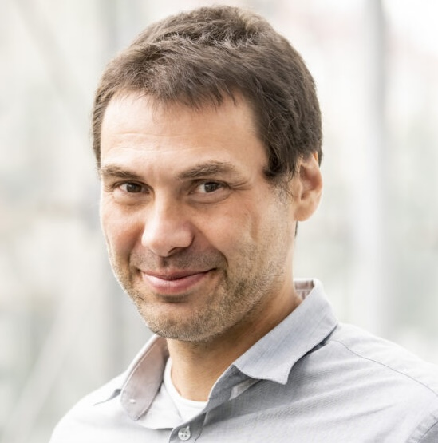
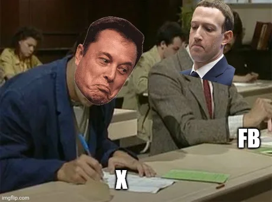

    <canvas id="canvas" style="width: 100%; height: 100%"></canvas>
      <component is="script">
        const canvas = document.getElementById('canvas');
        const ctx = canvas.getContext('2d');
        function resize() {
            canvas.width = window.innerWidth;
            canvas.height = window.innerHeight;
        }
        window.addEventListener('resize', resize);
        resize();
        const cellSize = 3;
        const cols = Math.floor(canvas.width / cellSize);
        const rows = Math.floor(canvas.height / cellSize);
        let grid = new Array(cols * rows).fill(0);
        let nextGrid = new Array(cols * rows).fill(0);
        for(let i = 0; i < grid.length; i++) {
            grid[i] = Math.random() > 0.70 ? 1 : 0;
        }
        function getIndex(x, y) {
            x = (x + cols) % cols;
            y = (y + rows) % rows;
            return y * cols + x;
        }
        function computeNextState(x, y) {
            let neighbors = 0;
            for(let i = -1; i <= 1; i++) {
                for(let j = -1; j <= 1; j++) {
                    if(i === 0 && j === 0) continue;
                    neighbors += grid[getIndex(x + i, y + j)];
                }
            }
            const idx = getIndex(x, y);
            if(grid[idx] === 1) {
                return neighbors === 2 || neighbors === 3 ? 1 : 0;
            } else {
                return neighbors === 3 ? 1 : 0;
            }
        }
        function sleep(ms) {
          return new Promise(resolve => setTimeout(resolve, ms));
        }
        function draw() {
            ctx.fillStyle = '#111';
            ctx.fillRect(0, 0, canvas.width, canvas.height);
            ctx.fillStyle = '#fffff4';
            for(let x = 0; x < cols; x++) {
                for(let y = 0; y < rows; y++) {
                    if(grid[getIndex(x, y)] === 1) {
                      ctx.beginPath();
                      ctx.arc(x * cellSize + cellSize/2, y * cellSize + cellSize/2, (cellSize - 1)/2, 0, Math.PI * 2);
                      ctx.fill();
                    }
                }
            }
        }
        function update() {
            for(let x = 0; x < cols; x++) {
                for(let y = 0; y < rows; y++) {
                    nextGrid[getIndex(x, y)] = computeNextState(x, y);
                }
            }
            const blockSize = 3;
            const blockChance = 0.0001;
            for(let x = 0; x < cols; x += blockSize) {
                for(let y = 0; y < rows; y += blockSize) {
                    if(Math.random() < blockChance) {
                        for(let i = 0; i < blockSize; i++) {
                            for(let j = 0; j < blockSize; j++) {
                                if(x + i < cols && y + j < rows) {
                                    nextGrid[getIndex(x + i, y + j)] = 1;
                                }
                            }
                        }
                    }
                }
            }
            [grid, nextGrid] = [nextGrid, grid];
        }
        async function animate() {
            await sleep(20);
            update();
            draw();
            requestAnimationFrame(animate);
        }
        animate();
    </component>

<v-click>

# Une thèse en ~~180 secondes~~  *30 minutes*

Apprentissage non supervisé dans les systèmes complexes

</v-click>

Un simulation du Jeu de la Vie de Conway

---
transition: fade-out

---

# Un peu de contexte

- Un stage de recherche de 6 mois à Prague (S2 2019)

- 3 ans de recherche à l'INRIA/ENS et au CIIRC  *(Institut de recherche en informatique, robotique et cybernétique de l'Université technique de Prague)*

- 2 directeurs de thèse: Tomas Mikolov et Josef Sivic
  

    
    
  

- Thèse finalisée en Décembre 2022, soutenue en Mai 2023 

---
transition: slide-left
---

# Qu'ont-ils en commun ?

---
layout: 3-images
transition: slide-left
imageLeft: './assets/image.jpg'
imageTopRight: './assets/traffic.jpg'
imageBottomRight: './assets/ant.jpg'
---

# Qu'ont-ils en commun ?

---
layout: section
transition: slide-left
---

<h1 class="text-shadow-lg text-shadow-black-10">Les systèmes complexes</h1>

---
transition: slide-left
---
# Qu'est-ce qu'un système complexe ?

> <h2>"<i>Le tout est plus la somme de ses parties</i>"</h2>
> inconnu

**Définition simple** : Un système complexe est constitué de: 

<v-clicks>

- nombreuses parties qui interagissent entre elles 

- pour créer des comportements inattendus

- qui ne peuvent pas être expliqués en observant les parties individuelles seules.

</v-clicks>

---
transition: slide-left
---

# Exemples dans votre quotidien

<v-clicks>

- **Réseaux Sociaux**: Chaque personne fait des choix *simples* (comme aimer, partager, commenter) mais ensemble ils créent des tendances virales, des memes, des changement globaux et systémiques

- **Embouteillages**: Chaque voiture qui suit des règles *simples* (accélérer, freiner, changer de voie), qui peuvent créer des vagues de congestion et des embouteillages inattendus

- **Météo**: Les interactions entre des molécules dans l'air et l'eau créent des tempêtes et des phénomènes météorologiques complexes

</v-clicks>

<v-click at="-2">

</v-click>

<v-click at="2">

</v-click>

<v-click at="3">

</v-click>

---
transition: slide-left
---

# Caractéristiques des systèmes complexes

### **Émergence** : Des patterns apparaissent qui n'ont pas été programmés dans les parties individuelles

  - Comme les fourmis qui ne savent pas qu'elles construisent des colonies de fourmis

### **Auto-organisation** : Le système s'organise sans un contrôle central

  - Comme comment les oiseaux forment des V sans un leader

### **Imprévisible** : Les petites modifications peuvent avoir des grandes conséquences

  - Comme comment n'importe quelle petite variation de pression de l'air peut affecter la météo ailleurs

---
transition: slide-up
---

<iframe src="https://www.complexity-explorables.org/slides/flockn-roll/" width="100%" height="700px" scrolling="no"></iframe>

<h2>Simulons un système complexe</h2>

<h3>Règles simples</h3>

Chaque "oiseau" doit:

1. Essayer de rester proche de ses voisins

2. Ne pas foncer dans les autres oiseaux 

3. Adapte sa vitesse pour être proche de celle de ses voisins

---
layout: section
transition: slide-left
---

<h1 class="text-shadow-lg text-shadow-black-10">Évolution ouverte   (<i>open-ended evolution</i>)</h1>

---
transition: slide-left
---
# Évolution ouverte

> <h2>"<i>Une capacité à continuer à grandir, évoluer et créer de nouvelles choses à l'infini</i>"</h2>

<v-click hide>

</v-click>

<v-after>

</v-after>

---
---

# Ressources

<h2>📚 Livres</h2>

- "Collective Animal Behavior" - David Sumpter
- "Swarm Intelligence" - James Kennedy
- "Self-Organization in Biological Systems" - Scott Camazine

<h2>🎥 Vidéos</h2>

- ["*Le Jeu de la Vie*" - Science Étonnante](https://www.youtube.com/watch?v=S-W0NX97DB0)
- ["*Emergence: How Stupid Things Become Smart Together*" - Kurzgesagt](https://www.youtube.com/watch?v=16W7c0mb-rE)
- ["*Magnetic Micro-Robots*" - Veritasium](https://www.youtube.com/watch?v=N7lXymxsdhw)

<h2>📄 Articles</h2>

- "From Fish to Human Crowds: A Unified Theory" - Nature
- "Collective Motion and Decision Making" - Science
- "Self-organized Traffic Flow" - Physical Review E

<h2>🌐 Sites Web</h2>

- [Complexity Explorables](https://www.complexity-explorables.org/)
- [Complexity Explorer](https://www.complexityexplorer.org)
- [Santa Fe Institute](https://www.santafe.edu)

---
layout: statement
---

# Merci pour votre attention !